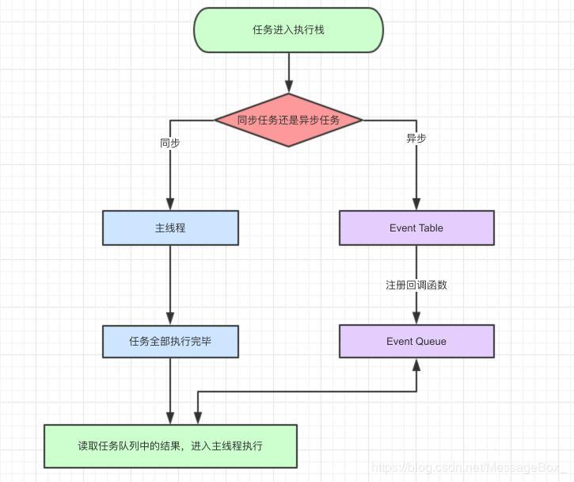
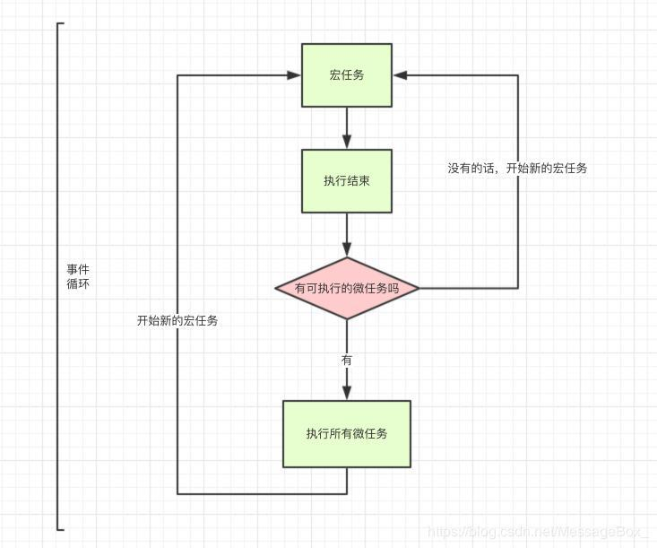

<!--
 * @Description:
 * @Author: panrui
 * @Date: 2023-06-02 13:43:23
 * @LastEditTime: 2023-06-02 13:54:13
 * @LastEditors: panrui
 * 不忘初心,不负梦想
-->

## 事件循环



> 1.  执行同步任务：JavaScript 引擎会先执行当前调用栈中的所有同步任务，直到调用栈为空。
> 2.  处理微任务：在执行完同步任务后，JavaScript 引擎会立即处理所有的微任务。微任务是指通过 Promise 对象注册的回调函数、MutationObserver 等异步操作产生的任务。微任务会被添加到一个微任务队列中，等待 JavaScript 引擎执行。
> 3.  处理宏任务：在处理完所有的微任务后，JavaScript 引擎会从事件队列中取出一个宏任务，并将其加入到调用栈中执行。宏任务是指通过 setTimeout、setInterval、I/O 事件等异步操作产生的任务。
> 4.  重复执行上述步骤：重复执行上述步骤，直到事件队列为空。
>     需要注意的是，在执行宏任务的过程中，可能会产生新的微任务，这些微任务会被添加到微任务队列中，等待 JavaScript 引擎执行。只有当当前的宏任务和所有微任务都执行完成后，才会开始处理下一个宏任务。
>     JavaScript 事件循环的机制使得 JavaScript 可以有效地处理异步任务，并且保证了任务的执行顺序。但是，如果某个任务的执行时间过长，会阻塞事件循环，导致其他任务无法及时得到处理。因此，在编写 JavaScript 代码时，需要注意避免产生耗时的操作，以提高 JavaScript 应用程序的性能。

## 宏任务与微任务



> 1.  宏任务包括整体代码 script，setTimeout，setInterval
> 2.  微任务 Promise，process.nextTick

```js
setTimeout(function () {
  console.log(1);
}, 0);

new Promise(function (resolve) {
  console.log(2);
  resolve();
}).then(function () {
  console.log(3);
});

console.log(4);

// 执行结果 2、4、3、1

// 整体代码script作为一个宏任务开始执行
// 首先遇到setTimeout,作为一个异步函数,他的回调属于一个宏任务
// new Promise 立即执行,他的状态改变做为一个微任务 所以先打印2
// 然后执行到最外层 打印4
// 我们先看看当前宏任务中是否还存在微任务需要处理, 所以接着打印3
// 微任务执行完毕,看看是否还有新的宏任务, 最后打印1
```


最后更新时间：2024-4-28 16:03:47