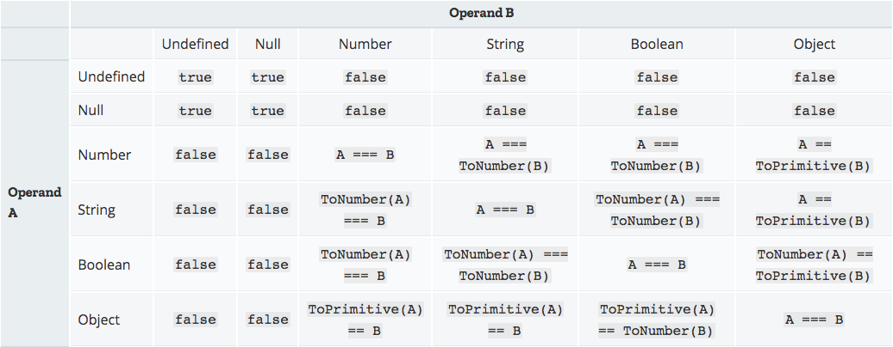

<!--
 * @Description:
 * @Author: panrui
 * @Date: 2023-06-02 14:54:41
 * @LastEditTime: 2023-06-02 15:03:34
 * @LastEditors: panrui
 * 不忘初心,不负梦想
-->

## 最后更新时间：2023-06-02 14-54-53

#### 在 JS 环境中，如果让 a==1 && a==2 && a==3

一个值在没有手动修改的情况下，在一个表达式中是不会变化的。问题的关键在于宽松相等时会对一些变量进行隐式转换。

#### ToPrimitive (拆箱)

```
在 JavaScript 中，如果想要将一个对象转换成基本数据类型时，也就是所谓的拆箱时，会调用 toPrimitive()
函数结构：toPrimitive(input,preferedType?)

执行过程
如果转换的类型是number，会执行以下步骤：
1. 如果input是原始值，直接返回这个值；
2. 否则，如果input是对象，调用input.valueOf()，如果结果是原始值，返回结果；
3. 否则，调用input.toString()。如果结果是原始值，返回结果；
4. 否则，抛出错误。

如果转换的类型是String，2和3会交换执行，即先执行toString()方法。
```

## 宽松相等判断真值表



#### 解决方案

```js
// 方案一
const a = {
  i: 1,
  toString: function () {
    return a.i++;
  },
};

// 方案二
const a = {
  i: 1,
  valueOf() {
    return this.i++;
  },
};

// 方案三
var a = new Proxy(
  { i: 1 },
  {
    get(target) {
      return () => target.i++;
    },
  }
);
```
