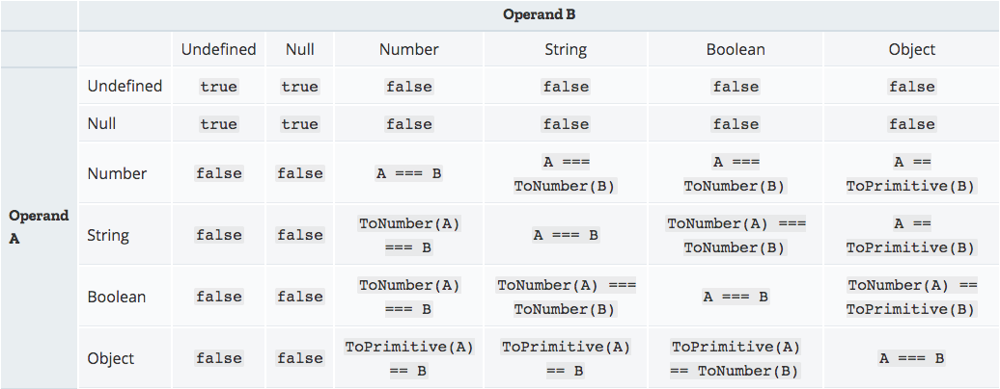

<!--
 * @Description: 记录文档
 * @Author: prui
 * @Date: 2024-04-28 14:11:31
 * @LastEditTime: 2024-04-28 16:08:07
 * @LastEditors: prui
 * 不忘初心,不负梦想
-->

## switch

- 使用严格运算符 === 进行判断
- 多个 case 与提供的值匹配，则选择匹配的第一个 case
- break 确保程序立即从相关的 case 子句中跳出 switch，并接着执行 switch 之后的语句，若 break 被省略，程序会继续执行 switch 语句中的下一条语句。
- 默认情况下，整个 switch 为一个块级作用域

```js
// 基于第三点产生骚操作
// 多case - 单一操作
var Animal = "Giraffe";
switch (Animal) {
  case "Cow":
  case "Giraffe":
  case "Dog":
  case "Pig":
    console.log("This animal will go on Noah's Ark.");
    break;
  case "Dinosaur":
  default:
    console.log("This animal will not.");
}
// 多case - 关联操作 (应用范围属实有点难匹配)
var foo = 1;
var output = "Output: ";
switch (foo) {
  case 0:
    output += "So ";
  case 1:
    output += "What ";
    output += "Is ";
  case 2:
    output += "Your ";
  case 3:
    output += "Name";
  case 4:
    output += "?";
    console.log(output);
    break;
  case 5:
    output += "!";
    console.log(output);
    break;
  default:
    console.log("Please pick a number from 0 to 5!");
}
```

```js
// 基于第四点作用域解释
// 第一种解决方式 (使用括号包裹) // Unexpected lexical declaration in case block 不知道这个错误还会不会提示，因为 ECMAScript 规定，在 switch 语句的 case 或 default 子句内部不允许直接声明变量。TODO待验证....
const action = "say_hello";
switch (action) {
  case "say_hello": {
    // added brackets
    let message = "hello";
    console.log(message);
    break;
  } // added brackets
  case "say_hi": {
    // added brackets
    let message = "hi";
    console.log(message);
    break;
  } // added brackets
  default: {
    // added brackets
    console.log("Empty action received.");
    break;
  } // added brackets
}
```

## 在 JS 环境中，如果让 a==1 && a==2 && a==3

一个值在没有手动修改的情况下，在一个表达式中是不会变化的。问题的关键在于宽松相等时会对一些变量进行隐式转换。

## ToPrimitive (拆箱)

```
在 JavaScript 中，如果想要将一个对象转换成基本数据类型时，也就是所谓的拆箱时，会调用 toPrimitive()
函数结构：toPrimitive(input,preferedType?)

执行过程
如果转换的类型是number，会执行以下步骤：
1. 如果input是原始值，直接返回这个值；
2. 否则，如果input是对象，调用input.valueOf()，如果结果是原始值，返回结果；
3. 否则，调用input.toString()。如果结果是原始值，返回结果；
4. 否则，抛出错误。

如果转换的类型是String，2和3会交换执行，即先执行toString()方法。
```

## 宽松相等判断真值表



#### 解决方案

```js
// 方案一
const a = {
  i: 1,
  toString: function () {
    return a.i++;
  },
};

// 方案二
const a = {
  i: 1,
  valueOf() {
    return this.i++;
  },
};

// 方案三
var a = new Proxy(
  { i: 1 },
  {
    get(target) {
      return () => target.i++;
    },
  }
);
```


最后更新时间：2024-4-28 15:57:41
